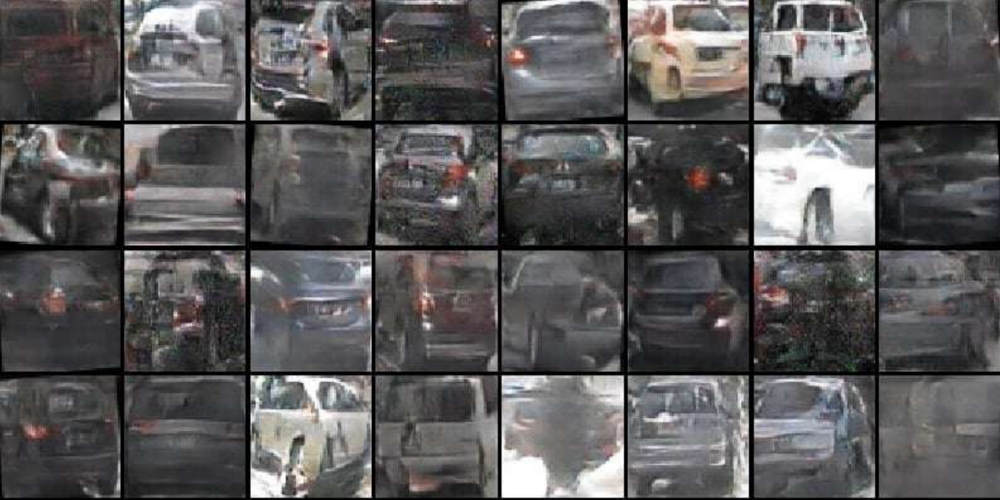

# AutoDoppelGANger
## Summary
AutoDoppelGANger is a DCGAN model trained to generate images of cars based on photos from the NuImages dataset. The project involves a full machine learning pipeline, from data collection to validation and evaluation of model results. Core elements of the project include:
- Data gathering(cutting out cars images from NuImages dataset)
- Dataset analysis
- Data labeling
- Data augmentation
- Implementation of DCGAN network
- Evaluation
## Tech stack
| Category | Library |
|----------|----------|
| Deep Learning | PyTorch, numpy |
| Image processing | OpenCV-python |
| Dataset handling | Nuscenes-devkit, pandas |
| Data analyzing | pandas |
| Visualisation | Matplotlib |
| Evaluation | Scipy |
## Dataset
Original source of the data is [NuImages](https://www.nuscenes.org/nuimages) dataset. It consists of 93,000 2d annotated images intended for autonomous driving. However, our target was generating cars images, yet NuImages pictures included the road and all the surroundings. Therefore, to create the dataset we needed, we had to cut out pictures of cars from NuImages based on their annotated bounding boxes.

The dataset included photos of cars from various directions, in addition to photos of bicycles, motorcycles and mislabeled ones. After training on these images it turned out that they were too diverse for the model to learn how to generate accurate car images.

 
The solution to this problem was semi-automated (with labeling_script.sh) hand-labeling of car images into three categories:
- front
- side
- back

In this way, we created the final version of the dataset.
You can download it here: [vehicles-from-nuimages-kaggle](https://www.kaggle.com/datasets/aleksanderszymczyk/vehicles-from-nuimages/data)
## Instalation
Clone this repository, then run `pip install -r requirements.txt`.
## Usage
To ensure easy and comfortable usage, we implemented simple shell where all of project's features are available with commands. To start it, you need to run `python3 main.py`, then type `help` and follow the instructions.
### Training
You can train the model with your own configuration. To do so, you need to download the dataset onto your device. Load it using `lddst <filepath>`. We recommend training the model with *front*, *side* and *back* datasets separately. Then in `train_config.json`, set the chosen hyperparameters and run `train <path to json file>`. If you set `"save_weights": true`, weights will be saved after training in `models/checkpoints` directory.
### Inference
If you want to load weights trained by us or yours after training, use `ldwghts <path to discriminator weights> <path to generator weights>`. To generate samples and show them in pyplot, run `gensam <num_samples> <num_rows> <num_columns>`.
### Evaluation
To evaluate the model (beside visual inspection), you can run command `incsc`. It will calculate the Inception Score for given model. For baseline, we measured the following inception scores on the vehicles-from-nuimages dataset:
- IS for a model without training = 2.4884553
- IS for original images = 4.1818676

Models trained by us achieved IS in range of 3.5 - 3.75
## Generated cars
### Front results

### Side results

### Back results

## License
This project is licensed under the terms of the [MIT license](https://opensource.org/licenses/MIT).
## Authors
[@AtarSander](https://github.com/AtarSander) [@mikorozek](https://github.com/mikorozek)